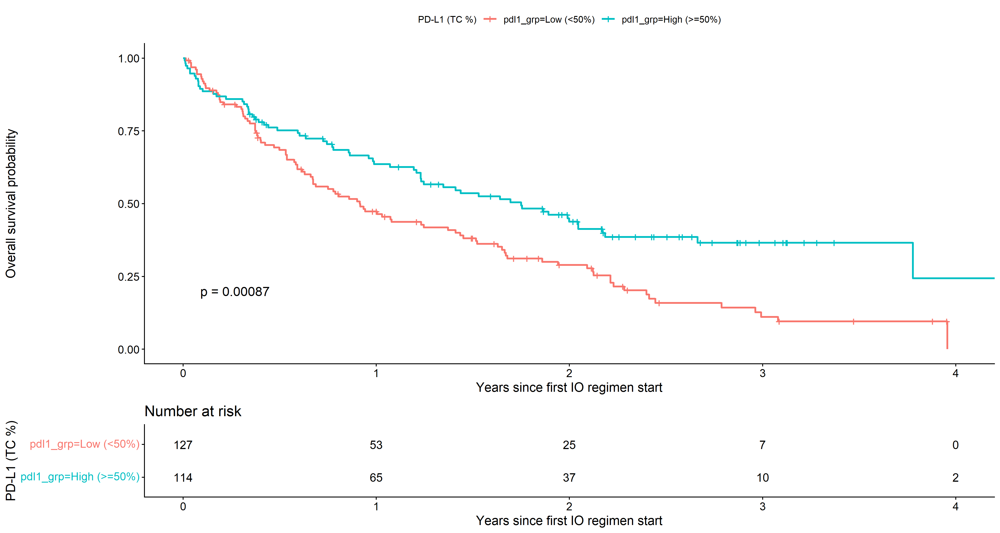
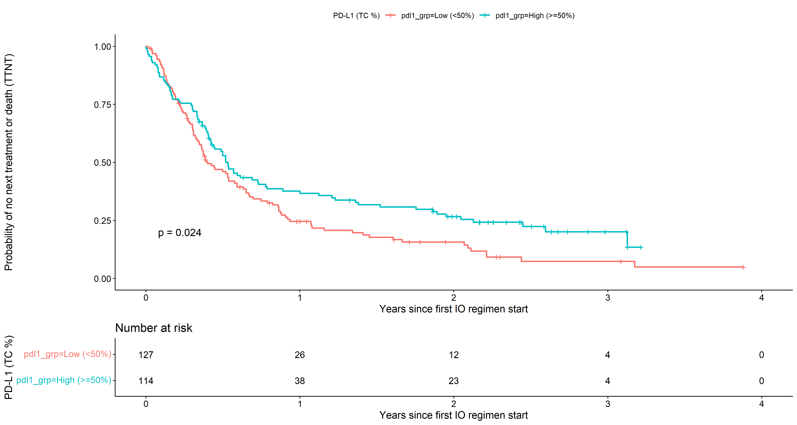
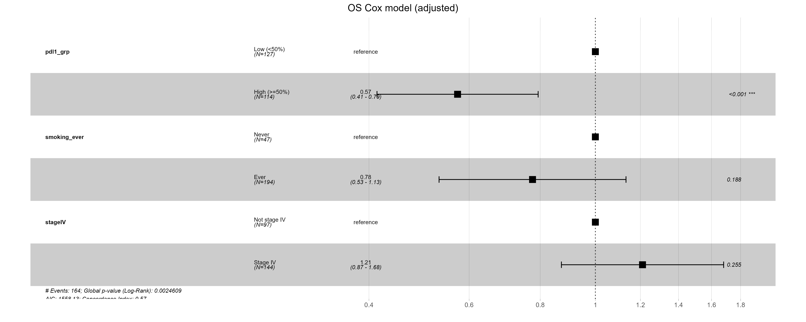
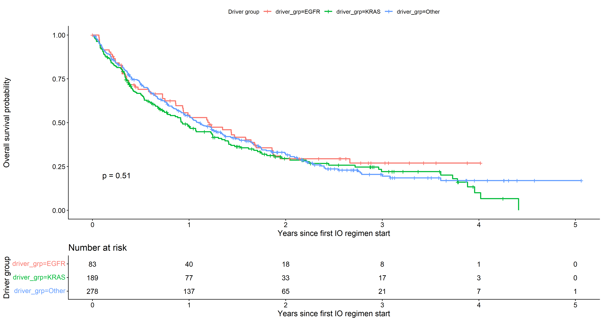
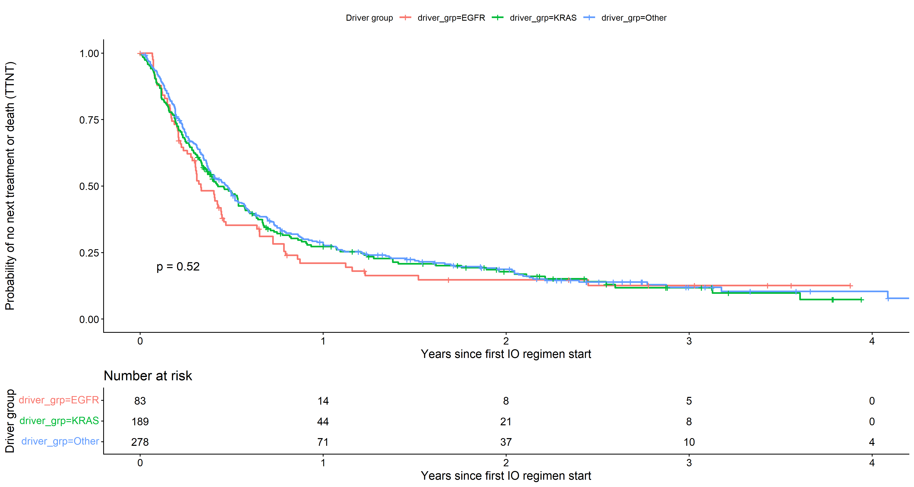
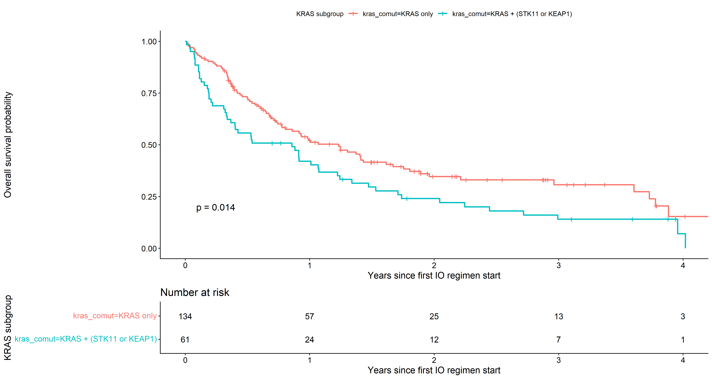
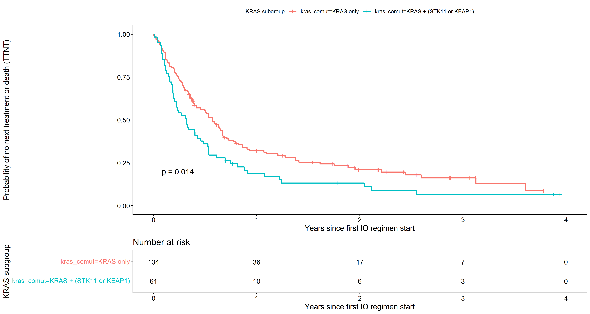
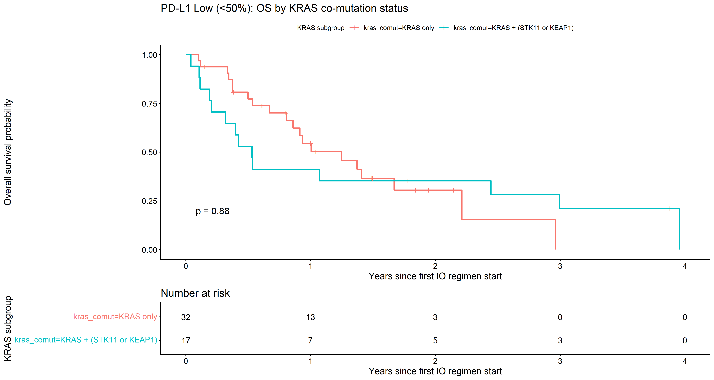

# NSCLC Real-World Immunotherapy Outcomes (RWE)


**Josep-Ramon Codina** *PhD candidate in Biochemistry & Molecular
Biology* \* [LinkedIn Profile](https://www.linkedin.com/in/jrcodina/) \*
[jr.codina96\@gmail.com](mailto:jr.codina96@gmail.com)

## Project overview

This analysis evaluates real-world outcomes after immune checkpoint
inhibitor (IO) regimens in non-small cell lung cancer (NSCLC). It
focuses on two time-to-event endpoints measured from the start of each
patient's first IO regimen:

1.  Overall survival (OS)
2.  Time to next treatment or death (TTNT)

The primary goals are to quantify associations between outcomes and (a)
PD-L1 tumor cell percentage, (b) canonical driver alterations (EGFR vs
KRAS vs other), and (c) KRAS co-mutation status (STK11 and KEAP1).

## Data sources and inputs

The datasets are derived from the AACR Project GENIE Biopharma
Collaborative (BPC) NSCLC release. The pipeline expects the following
input files (not included here). Place them under `./data/`:

| File | Used for | Key columns referenced |
|------------------------|------------------------|------------------------|
| `data_clinical_sample.txt` | Map sample IDs to patient IDs | `PATIENT_ID`, `SAMPLE_ID` |
| `data_mutations_extended.txt` | Somatic mutations (MAF-like) | `Tumor_Sample_Barcode`, `Hugo_Symbol` |
| `cancer_level_dataset_index.csv` | Clinical cohort filter and covariates | `record_id`, `cohort`, `stage_dx_iv`, `ca_lung_cigarette` |
| `pathology_report_level_dataset.csv` | PD-L1 tumor cell percent | `record_id`, `cohort`, `pdl1_perc`, `pdl1_perc_2`, `pdl1_perc_3` |
| `regimen_cancer_level_dataset.csv` | Regimen selection and endpoints | `record_id`, `cohort`, `regimen_drugs`, `drugs_startdt_int_1`, `tt_os_g_yrs`, `os_g_status`, `ttnt_ca_seq_yrs`, `ttnt_ca_seq_status` |

## Data source, access, and compliance

This analysis uses Real-World Evidence (RWE) from the AACR Project GENIE
Biopharma Collaborative (BPC).

Important note on data access: This repository contains the analysis
code (.R scripts) and generated figures. The raw clinical and genomic
data files are not included in this repository in compliance with the
AACR Project GENIE Data Use Agreement. The AACR GENIE BPC dataset is a
publicly available resource, but it requires registration and acceptance
of terms.

To reproduce this analysis: 1. Register and request access via the [AACR
Project GENIE
portal](https://www.aacr.org/professionals/research/aacr-project-genie/)
(see the AACR Project GENIE page below). 2. Download the NSCLC BPC
dataset (Synapse release). 3. Place the data files in the `./data`
directory (this folder should be ignored by git), matching the filenames
referenced in the script headers.

AACR Project GENIE portal:

``` text
https://www.aacr.org/professionals/research/aacr-project-genie/
```

This analysis utilizes data from the AACR Project GENIE Biopharma
Collaborative. The interpretations presented here are the author's own
and do not represent the official position of the AACR.

## Cohort and feature definitions

Cohort: Patients are restricted to `cohort == "NSCLC"` in the clinical,
pathology, and regimen tables.

IO regimens: Regimens are flagged as IO if `regimen_drugs` contains any
of the following (case-insensitive): pembrolizumab, nivolumab,
atezolizumab, durvalumab, cemiplimab. For each patient, the first IO
regimen is selected as the earliest by `drugs_startdt_int_1`.

PD-L1: For each pathology report row, the maximum tumor-cell percent
across `pdl1_perc`, `pdl1_perc_2`, and `pdl1_perc_3` is computed, then
the maximum across rows is taken per patient. Patients are grouped as:

-   Low (\<50%)
-   High (\>=50%)

Genomics: Mutations are collapsed to per-patient binary flags for
selected genes. The downstream analyses use EGFR, KRAS, STK11, and
KEAP1. Driver group is defined as EGFR if EGFR mutated, else KRAS if
KRAS mutated, else Other. Within KRAS, co-mutation status is defined as
KRAS + (STK11 or KEAP1) vs KRAS only.

Covariates used for adjusted models:

-   Smoking history: Never vs Ever, based on `ca_lung_cigarette` (Never
    used vs all other non-missing values)
-   Stage at diagnosis: Stage IV vs Not stage IV, based on `stage_dx_iv`

## Methods

Kaplan-Meier curves are estimated with log-rank p-values and risk tables
using `survminer::ggsurvplot`.

Cox proportional hazards models are fit with `survival::coxph`. For
PD-L1 analyses, adjusted models include PD-L1 group, smoking history,
and Stage IV status. Forest plots are generated with
`survminer::ggforest`.

## Key results from the current run

### 1) PD-L1 stratification (IO cohort)

PD-L1 High (\>=50%) shows longer OS and longer TTNT compared with PD-L1
Low (\<50%) in Kaplan-Meier analyses.

**Figure 1A. OS by PD-L1 group**\


**Figure 1B. TTNT by PD-L1 group**\


### 2) Adjusted OS Cox model

After adjustment for smoking history and Stage IV status, PD-L1 High
(\>=50%) is associated with a lower hazard of death compared with PD-L1
Low (\<50%) (HR 0.57, 95% CI 0.41-0.79; p \< 0.001).

**Figure 2. Adjusted OS Cox model (forest plot)**\


### 3) Driver group comparisons (EGFR vs KRAS vs Other)

Across driver groups, OS and TTNT curves are similar in this analysis,
with non-significant log-rank tests in the current run.

**Figure 3A. OS by driver group**\


**Figure 3B. TTNT by driver group**\


### 4) KRAS co-mutation status (STK11 or KEAP1)

Within KRAS-mutant patients, KRAS + (STK11 or KEAP1) shows worse OS and
worse TTNT compared with KRAS only in the current run.

**Figure 4A. OS within KRAS by co-mutation status**\


**Figure 4B. TTNT within KRAS by co-mutation status**\


### 5) PD-L1 Low (\<50%) within KRAS

When restricting to PD-L1 Low (\<50%) KRAS-mutant patients, OS and TTNT
appear similar between KRAS only and KRAS + (STK11 or KEAP1) in the
current run. This subset is small, so uncertainty is high.

**Figure 5A. PD-L1 Low: OS within KRAS by co-mutation status**\


**Figure 5B. PD-L1 Low: TTNT within KRAS by co-mutation status**\


## Output artifacts

Plots are written to `./plots/` by default. The current script produces
the following files (filenames are fixed in the code):

| Output | Description |
|------------------------------------|------------------------------------|
| `KM_OS_by_PDL1.png` | Kaplan-Meier OS by PD-L1 group with risk table and log-rank p-value |
| `KM_TTNT_by_PDL1.png` | Kaplan-Meier TTNT by PD-L1 group with risk table and log-rank p-value |
| `Forest_OS_Cox_Adjusted.png` | Forest plot for adjusted OS Cox model |
| `KM_OS_by_DriverGroup.png` | Kaplan-Meier OS by driver group |
| `KM_TTNT_by_DriverGroup.png` | Kaplan-Meier TTNT by driver group |
| `KM_OS_KRAS_Comut.png` | Kaplan-Meier OS within KRAS by STK11/KEAP1 co-mutation status |
| `KM_TTNT_KRAS_Comut.png` | Kaplan-Meier TTNT within KRAS by STK11/KEAP1 co-mutation status |
| `KM_OS_KRAS_Comut_PDL1Low.png` | Kaplan-Meier OS within KRAS, restricted to PD-L1 Low (\<50%) |
| `KM_TTNT_KRAS_Comut_PDL1Low.png` | Kaplan-Meier TTNT within KRAS, restricted to PD-L1 Low (\<50%) |
| `Forest_TTNT_Cox_Adjusted.png` | Forest plot for adjusted TTNT Cox model (produced by the script when saved) |

The script also prints two denominator summaries to the console:
`denom_tbl` (data availability at each pipeline step) and `mut_tbl`
(mutation and co-mutation counts).

## How to run

1.  Create a `data/` folder and place the required input files there
    using the filenames shown above.
2.  Create a `plots/` folder (or let the script create it).
3.  Run the analysis script from the project root.

Example:

``` r
# from R
source("analysis.R")
```

Or from the terminal:

``` bash
Rscript analysis.R
```

## Software requirements

R version 4.1+ is recommended. The script uses `dplyr`, `tidyr`,
`stringr`, `readr`, `tibble`, `survival`, `survminer`, and `ggplot2`.

## Notes and limitations

This is a retrospective real-world analysis and is subject to selection
bias, missingness, and measurement variability. PD-L1 values are derived
by taking the maximum tumor-cell percent observed per patient, which can
inflate PD-L1 in patients with repeated testing. The IO regimen
selection relies on string matching, so drug naming conventions in
`regimen_drugs` should be checked carefully.

## Acknowledgments

This work is based on AACR Project GENIE Biopharma Collaborative data.
See the "Data source, access, and compliance" section above for the
required access steps and data use notes.

## Author

**Josep-Ramon Codina** *PhD candidate in Biochemistry & Molecular
Biology* \* [LinkedIn Profile](https://www.linkedin.com/in/jrcodina/) \*
[jr.codina96\@gmail.com](mailto:jr.codina96@gmail.com)
